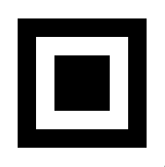

# capstone_detector

capstone_detector allows to detect the QR corner pattern called "capstones" in image :



Main of the work has been done by Daniel Beer in original quirc library, which is fast, small and easy to use.

capstone_detector has been made by :
- forking original quirc library
- replacing Makefile by CMake
- removing everything unneeded to detect capstone
- slightly reworking the public interface

The resulting library allows to detect capstones on small embedded devices such as ESP32-cam.

## How to build

```
cd capstone_detector
mkdir build
cd build
cmake ..
make
```

## How to use

```
struct quirc *q = quirc_new();

int capstone_count = quirc_detect_capstones(q, img, img_width, img_height);
for(int i=0;i<capstone_count;i++) {
    const struct quirc_capstone *capstone = quirc_get_capstone(q, i);
    printf("capstone->center: %i, %i\n", capstone->center.x, capstone->center.y);
}

quirc_destroy(q);
```

## Copyright

Copyright (C) 2010-2012 Daniel Beer <<dlbeer@gmail.com>>

Permission to use, copy, modify, and/or distribute this software for
any purpose with or without fee is hereby granted, provided that the
above copyright notice and this permission notice appear in all
copies.

THE SOFTWARE IS PROVIDED "AS IS" AND THE AUTHOR DISCLAIMS ALL
WARRANTIES WITH REGARD TO THIS SOFTWARE INCLUDING ALL IMPLIED
WARRANTIES OF MERCHANTABILITY AND FITNESS. IN NO EVENT SHALL THE
AUTHOR BE LIABLE FOR ANY SPECIAL, DIRECT, INDIRECT, OR CONSEQUENTIAL
DAMAGES OR ANY DAMAGES WHATSOEVER RESULTING FROM LOSS OF USE, DATA OR
PROFITS, WHETHER IN AN ACTION OF CONTRACT, NEGLIGENCE OR OTHER
TORTIOUS ACTION, ARISING OUT OF OR IN CONNECTION WITH THE USE OR
PERFORMANCE OF THIS SOFTWARE.
